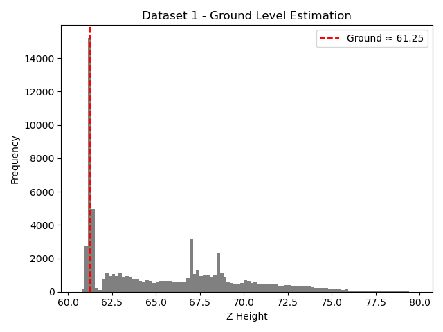
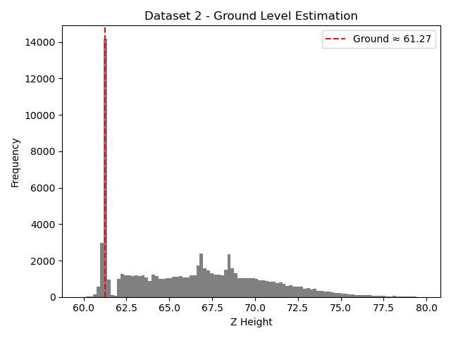
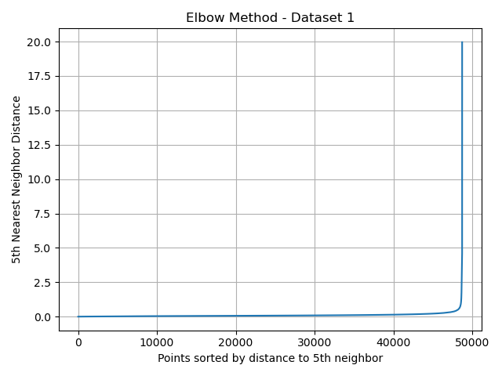
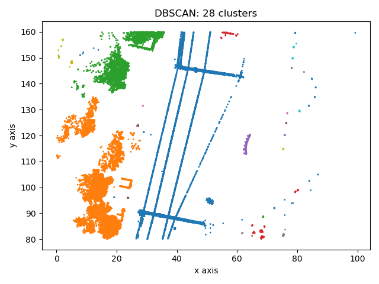
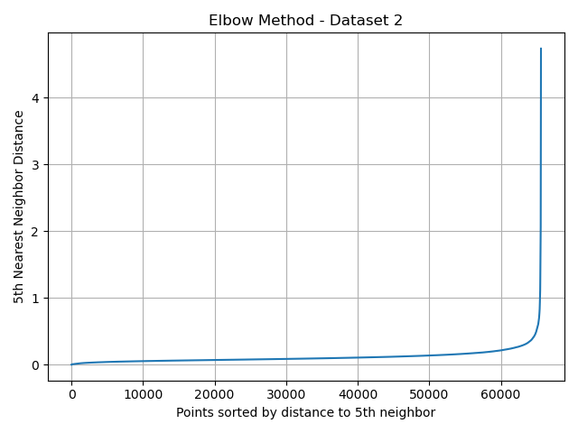
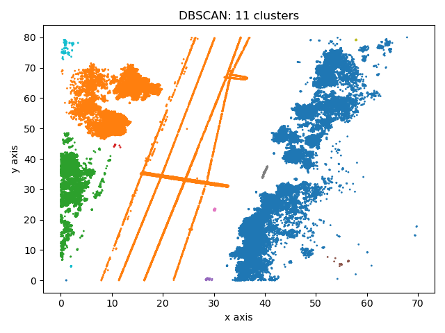
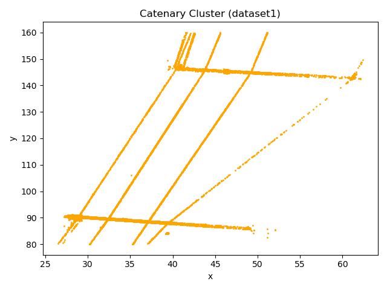
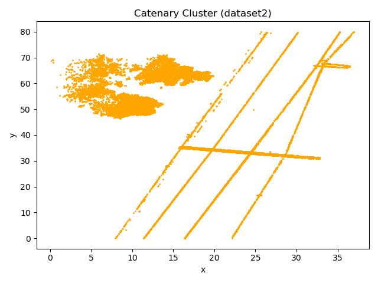

# Assignment 5 – LiDAR Ground Level Estimation

## Task 1 – Ground Level Detection

In this task, I estimated the ground level of the point cloud data using a histogram-based mode approach. The z-values (height) of all the points were used to build a histogram, and the bin with the maximum frequency was chosen as the approximate ground level.

###  Method:
- Extracted the z-axis (height) values from the point cloud.
- Built a histogram using `numpy.histogram`.
- The bin with the highest frequency was selected as the ground level.
- Plotted and saved histogram plots.

###  Results:

####  Dataset 1
- **Estimated Ground Level:** `61.25`
- 

####  Dataset 2
- **Estimated Ground Level:** `61.27`
- 

---

## Task 2 – DBSCAN Clustering

###  Method:
- Filtered out ground-level points.
- Computed 5-nearest neighbor distances.
- Created an elbow plot to estimate `eps`.
- Selected **`eps ≈ 2.5`** by visual inspection.
- Applied `DBSCAN` clustering on 2D (x, y) projection.

###  Results:

####  Dataset 1
- **Estimated eps:** `2.5`
**Number of clusters:** `28`

##### Elbow Plot:

##### Cluster Result:

---

####  Dataset 2
- **Estimated eps:** `2.5`
- **Number of clusters:** `11`

##### Elbow Plot:

##### Cluster Result:

---

## Task 3 – Catenary Detection

In this task, we used the output of DBSCAN to detect the main catenary wire by identifying the largest spatial cluster (based on x + y span). This was done after ground removal and clustering.

---

###  Dataset 1
- **Catenary cluster ID:** 1
- **X range:** 26.50 – 62.38
- **Y range:** 80.22 – 159.96

#####  Catenary Cluster:

---

###  Dataset 2
- **Catenary cluster ID:** 1
- **X range:** 0.18 – 37.01
- **Y range:** 0.01 – 79.98

#####  Catenary Cluster:

